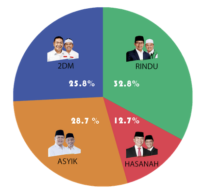
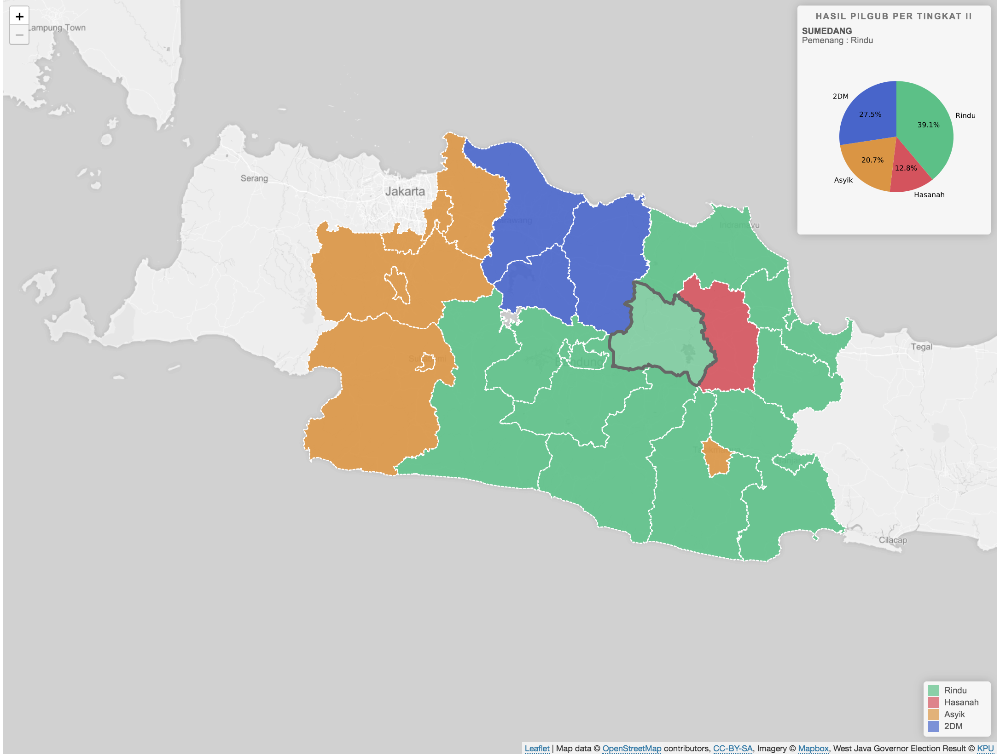
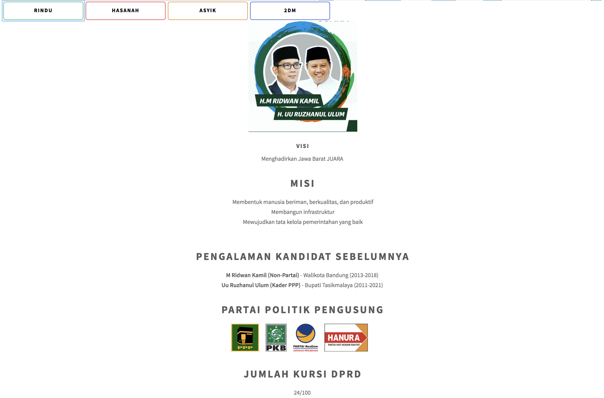

# Tugas 2 Visualisasi Data dan Informasi
# Pilkada Jabar 2018
Visualisasi Hasil Pilkada Jabar 2018 dan Pengenalan calon gubernur dan calon wakil gubernur Jabar 2018

## Live Demo
https://infinite-mountain-18326.herokuapp.com/

## Tampilan/Visualisasi yang ada 
### <i>Pie Chart</i> Hasil Pilkada Jabar

<i>Pie Chart</i> ini merupakan hasil keseluruhan dari pilkada Jabar.
### <i>Map Chart</i> Hasil Pilkada Jabar per Daerah Tingkat II (Kabupaten/Kota)

<i>Map Chart</i> ini menampilkan hasil pilkada Jabar berdasarkan kabupaten/kota.  
<i>Hover</i> ke kabupaten/kota yang diinginkan untuk melihat hasil pilkada.
### Penjelasan Masing-Masing Kandidat

Menjelaskan visi, misi, pengalaman kandidat, partai politik pengusung, dan jumlah kursi DPRD.  
Klik tombol cagub-cawagub yang diinginkan untuk melihat penjelasan. 