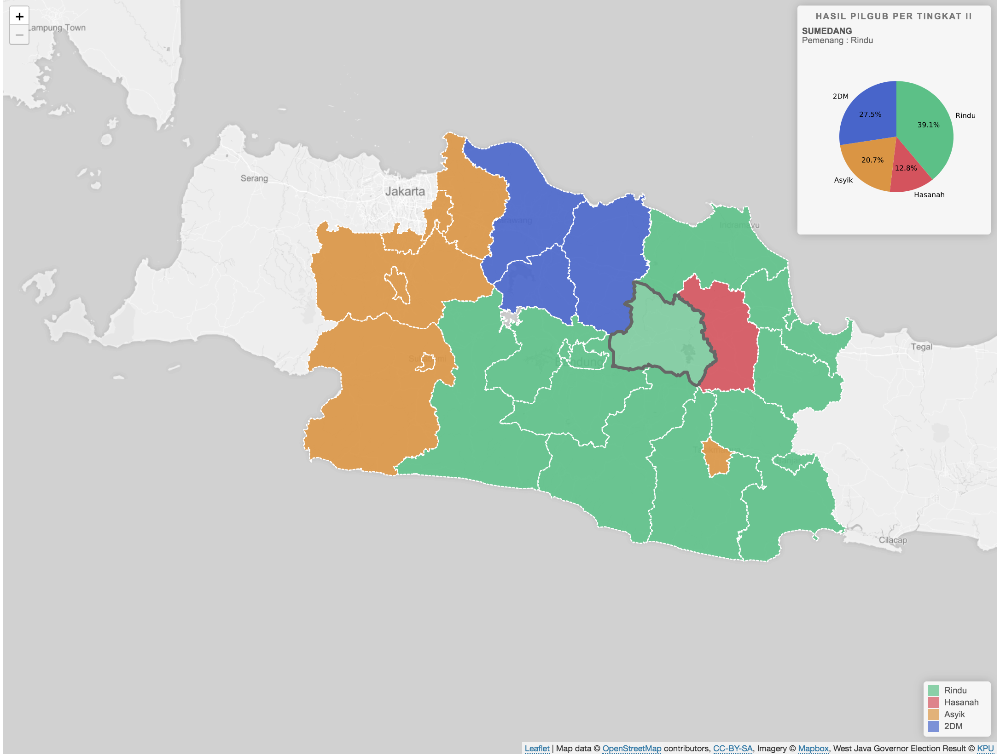
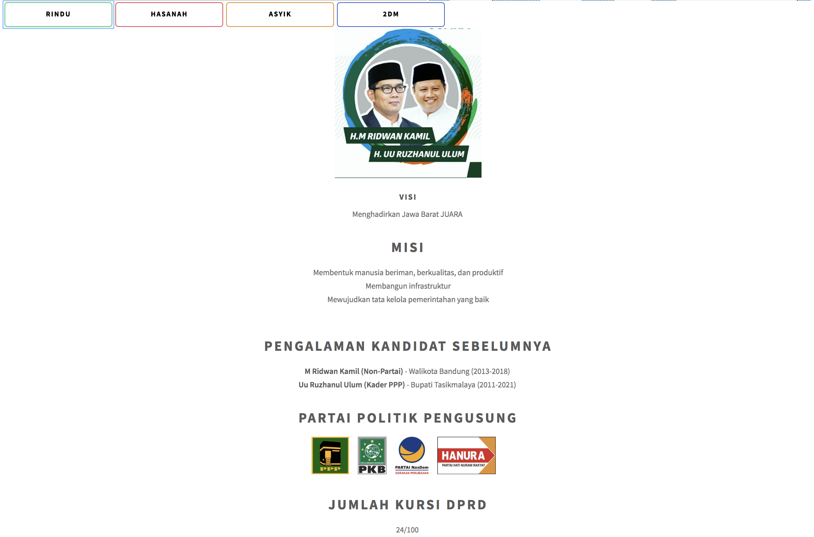

# Tugas 2 Visualisasi Data dan Informasi
# Pilkada Jabar 2018
Visualisasi Pilkada Jabar 2018

## Cara Menginstall
1. Clone/download repo ini
2. Buka folder src
3. Buka terminal
4. Jalankan command 'npm install'
5. Jalankan command 'npm run start'
6. Jalankan localhost:8000 di web browser

## Tampilan/Visualisasi yang ada 
### Pie Chart Hasil Pilkada Jabar

Pie Chart ini merupakan hasil keseluruhan dari pilgub Jabar.
### Map Chart Hasil Pilkada Jabar per Daerah Tingkat II (Kabupaten/Kota)

Map Chart ini menampilkan hasil pilgub Jabar berdasarkan kabupaten/kota  
Hover ke kabupaten/kota yang diinginkan untuk melihat hasil pilkada
### Penjelasan Masing-Masing Kandidat

Menjelaskan visi, misi, pengalaman kandidat,  
partai politik pengusung, dan jumlah kursi dprd  
Klik tombol cagub-cawagub yang diinginkan untuk melihat penjelasan